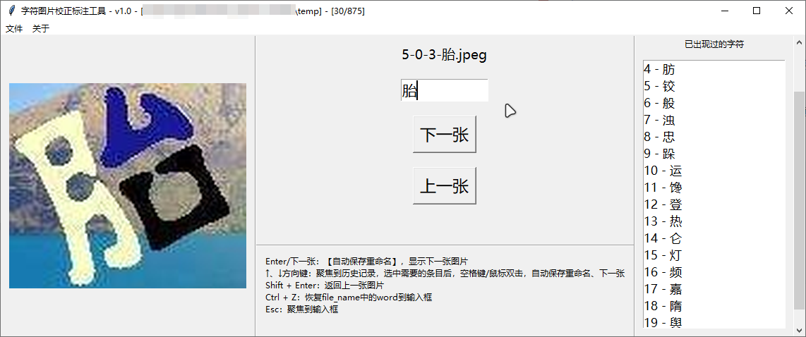
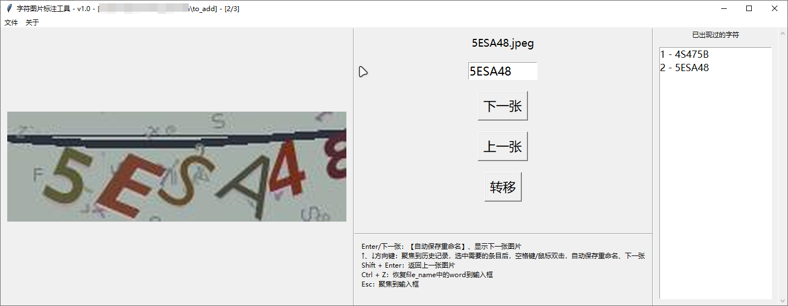

### 说明

一个小东西，玩 YOLO 时，用来方便自己打标一些数据的。yolo 真牛逼。

### 场景

1. 准备数据集，使用 ocr、初步训练好的模型，对一些图片进行预测、重命名。
然后需要手动校正一些识别错误的图片。此时可以使用本程序进行校正。

> 当然你要只是想看看结果也是可以的。

2. 或者只是需要对一批图片进行命名，此时可以自行设置好获取关键词函数，实现重命名。

3. 也可以自行添加按钮，遍历图片，将需要的图片转移到新的文件夹里
   - 比如看到一些可以拿来继续训练的图片，将其转到独立文件夹方便后续打标。

> 为了方便，程序使用了多个[快捷键](#快捷键)，几乎可以完全抛弃使用鼠标！

#### 例如：

- 使用孪生神经网络，需要正负样本，需要提供不同的字符图片。便校正用来区分



- 使用 yolov8 进行图片目标检测，测试结果，需要添加一些数据进行重新训练优化（添加了新按钮）。



### 使用

下载 `校正word.py` 即可，然后根据自己的需要，修改内部的三个函数：获取图片列表函数、获取关键词函数、重命名函数。

例如默认的函数为本项目中 test 文件夹的配套函数。

```python
labeler = ImageLabeler(
    root,
    # 默认打开文件夹，可为None
    image_folder,
    # 图片展示放大系数
    zoom_factor=3,
    # 限制输入最大长度，可设大于limit_submit_length，方便打字输入一个词组
    limit_input_length=4,
    # 限制提交时的限制长度
    limit_submit_length=1,
    # 获取图片列表函数
    get_file_list_func=get_files_by_name,
    # 获取关键词函数
    get_word_from_path_func=get_word_from_name,
    # 重命名函数
    rename_func=rename,
)
```

### 快捷键

`<Enter>`/`下一张`：【自动保存重命名】，显示下一张图片

`↑`、`↓`方向键：聚焦到历史记录，选中需要的条目后，空格键/鼠标双击，自动保存重命名、下一张

`<Shift> + <Enter>`：返回上一张图片

`<Ctrl> + <Z>`：恢复file_name中的word到输入框

`<Esc>`：聚焦到输入框

> 项目地址：[https://github.com/Ercilan/character_correction](https://github.com/Ercilan/character_correction)

